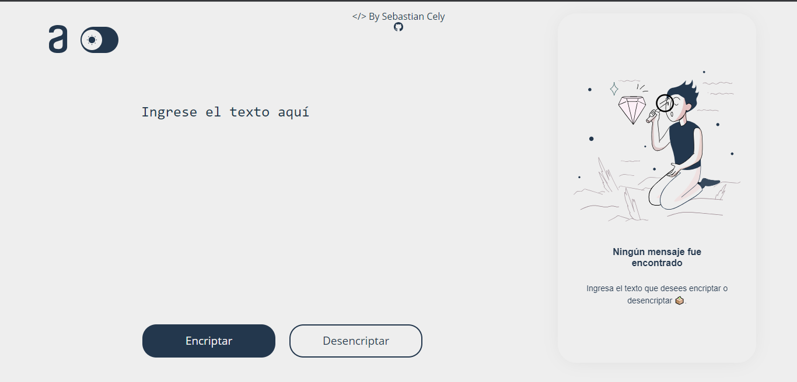

<h1> 🚀 Challenge Encriptador | Oracle + Alura <h1/>
<h2> By: Sebastian Cely Peña <h2/>
<a href="https://sebastianl2.github.io/ORACLE-Challenge_1-ECT/">Visualiza mi poryecto (lINK)</a>

    
    
    

  
#  Version 0.1

  

 
# ❄️Caracterisiticas del Challenge| proyecto

Las "llaves" de encriptación:
|  llave 🔑   |  'Encriptacion' 🔐 |
|  -------------  |  -------------  |
| "e" | "enter" |
| "i" | "imes" |
|"a"| "ai"|
|"o"| "ober"|  
|"u"|"ufat"|

# 🎯 Requisitos  
|  Estado  |  Funcion  |
|  -------------  |  -------------  |
|☑️|Debe funcionar solo con letras minúsculas|  
|☑️|No deben ser utilizados letras con acentos ni caracteres especiales  
|☑️|Debe ser posible convertir una palabra para la versión encriptada también devolver una palabra encriptada para su versión original|
|☑️|La página debe tener campos para inserción del texto que será encriptado o desencriptado, y el usuario debe poder escoger entre las dos opciones|
|☑️|El resultado debe ser mostrado en la pantalla|
 
# Funciones adicionales agregadas  

|  Estado  |  Funcion  |
|  -------------  |  -------------  |
|  ⚡  |  Sistema de identificacion del texto casos: si ya esta encriptado,enmayusculas,acentos,desencriptado  |
|  ⚡  |   Cambio de temas claro o oscuro |
|  ⚡  |  Agregado boton para pegar texto  |
|  ⚡  | Animaciones para: botone, aviso de mayusculas |

# 🔨 Funciones en desarrollo  

|  Estado  |  Funcion  |
|  -------------  |  -------------  |
|  🔨 |  Trabajando en selector de temas  |

# Application Designed as alura/Oracle next Education Program Development
by: Sebastian Cely Peña Developer - (SebastianL2)
Tools >                                                               
LIBRARIES:     
               REACTJS
               STYLED-COMPONENTS

# Aplicativo  Diseñado como Desarrollo del programa alura/Oracle next Education
by: Sebastian Cely Peña Developer - (SebastianL2)
Herrammientas >                                                                       
LIBRERIAS:     
               REACTJS
               STYLED-COMPONENTS

